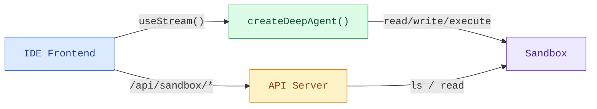

Coding agents need more than a chat window. They need a file browser, a code
viewer, and a diff panel — an IDE experience. This pattern connects a deep
agent to a [sandbox](/oss/javascript/javascript/deepagents/sandboxes) so it can read,
write, and execute code in an isolated environment, then exposes the sandbox
filesystem through a custom API server so the frontend can display files in
real time as the agent works.

import { PatternEmbed } from "/snippets/pattern-embed.jsx";

<PatternEmbed pattern="deep-agent-ide" />

## Architecture

The sandbox IDE pattern has three layers:

1. **Deep agent with sandbox backend** — The agent gets filesystem tools
   (`read_file`, `write_file`, `edit_file`, `execute`) automatically from the
   sandbox
2. **Custom API server** — A Hono app exposed via `langgraph.json`'s `http.app`
   field, providing file browsing endpoints the frontend can call
3. **IDE frontend** — A three-panel layout (file tree, code/diff viewer, chat)
   that syncs files in real time as the agent makes changes



## Setting up the agent

Create a deep agent with a sandbox backend. The sandbox is created at startup,
seeded with your project files, and shared between the agent and the API server.

### Choose a sandbox provider

Deep Agents supports multiple sandbox providers. Any provider that implements
the `SandboxBackendProtocol` works:


```ts
import { createDeepAgent, LangSmithSandbox } from "deepagents";

const sandbox = await LangSmithSandbox.create();

export const agent = createDeepAgent({
  model: "anthropic:claude-sonnet-4-5",
  backend: sandbox,
  systemPrompt: "You are an expert developer working on a project in /app.",
});
```


The agent automatically gets filesystem tools (`read_file`, `write_file`,
`edit_file`, `ls`, `glob`, `grep`) and an `execute` tool for running shell
commands. No tool configuration needed.

### Seed the sandbox

Before the agent runs, populate the sandbox with your project files using
`uploadFiles`:

```ts
const SEED_FILES: Record<string, string> = {
  "package.json": JSON.stringify({ name: "my-app", version: "1.0.0" }, null, 2),
  "src/index.js": 'console.log("Hello");',
};

const encoder = new TextEncoder();
await sandbox.uploadFiles(
  Object.entries(SEED_FILES).map(([path, content]) => [`/app/${path}`, encoder.encode(content)]),
);
```

<Tip>
  Run `sandbox.execute("cd /app && npm install")` after uploading `package.json` to install
  dependencies before the agent starts.
</Tip>

## Adding the file browsing API

The agent can read and write files, but the frontend also needs direct access to
browse the sandbox filesystem. Add a custom [Hono](https://hono.dev) API server
and expose it through the `http.app` field in `langgraph.json`.


### Create the API server

```ts
// src/api/app.ts
import { Hono } from "hono";
import { sandbox } from "../agents/my-agent.js";

export const app = new Hono();

// List directory contents
app.get("/api/sandbox/ls", async (c) => {
  const dirPath = c.req.query("path") || "/app";
  const result = await sandbox.execute(
    `find ${JSON.stringify(dirPath)} -maxdepth 1 -mindepth 1 -printf '%y\\t%s\\t%p\\n' 2>/dev/null | sort -t$'\\t' -k3`,
  );
  const entries = result.output
    .trim()
    .split("\n")
    .filter(Boolean)
    .map((line) => {
      const [typeChar, sizeStr, fullPath] = line.split("\t");
      return {
        name: fullPath.split("/").pop(),
        type: typeChar === "d" ? "directory" : "file",
        path: fullPath,
        size: parseInt(sizeStr, 10) || 0,
      };
    });
  return c.json({ path: dirPath, entries });
});

// Recursive file tree
app.get("/api/sandbox/tree", async (c) => {
  const rootPath = c.req.query("path") || "/app";
  const result = await sandbox.execute(
    `find ${JSON.stringify(rootPath)} -printf '%y\\t%s\\t%p\\n' 2>/dev/null | sort -t$'\\t' -k3`,
  );
  // Same parsing as above
  return c.json({ path: rootPath, entries: parseEntries(result.output) });
});

// Read file content
app.get("/api/sandbox/file", async (c) => {
  const filePath = c.req.query("path");
  if (!filePath) return c.json({ error: "path is required" }, 400);

  const results = await sandbox.downloadFiles([filePath]);
  const file = results[0];
  if (file.error) return c.json({ error: file.error }, 404);

  const content = new TextDecoder().decode(file.content!);
  return c.json({ path: filePath, content });
});
```


### Configure `langgraph.json`

Register both the agent graph and the API server. The `http.app` field tells
the LangGraph platform to serve your custom routes alongside the default ones:

```json
{
  "node_version": "22",
  "graphs": {
    "coding_agent": "./src/agents/my-agent.ts:agent"
  },
  "env": ".env",
  "http": {
    "app": "./src/api/app.ts:app"
  }
}
```


Your custom routes are available at the same host as the LangGraph API. For
local development with `langgraph dev`, that's `http://localhost:2024`.

<Note>
  Custom routes defined in `http.app` take priority over default LangGraph routes. This means you
  can shadow built-in endpoints if needed, but be careful not to accidentally override routes like
  `/threads` or `/runs`.
</Note>

## Building the frontend

The frontend has three panels: a file tree sidebar, a code/diff viewer, and a
chat panel. It uses `useStream` for the agent conversation and the custom API
endpoints for file browsing.

### File state management

Track two snapshots of the sandbox filesystem: the original state (before the
agent runs) and the current state (updated in real time). Comparing them
reveals which files changed:

```ts
const AGENT_URL = "http://localhost:2024";

interface FileSnapshot {
  [path: string]: string;
}

// Fetch the full file tree
async function fetchTree(): Promise<FileEntry[]> {
  const res = await fetch(`${AGENT_URL}/api/sandbox/tree?path=/app`);
  const data = await res.json();
  return data.entries.filter((e: FileEntry) => !e.path.includes("node_modules"));
}

// Fetch a single file's content
async function fetchFile(path: string): Promise<string | null> {
  const res = await fetch(`${AGENT_URL}/api/sandbox/file?path=${encodeURIComponent(path)}`);
  const data = await res.json();
  return data.content ?? null;
}
```

### Real-time file sync

The key to the IDE experience is updating files **as the agent works**, not
after it finishes. Watch the stream's messages for `ToolMessage` instances
from file-mutating tools. When a `write_file` or `edit_file` tool call
completes, refresh that specific file. When `execute` completes, refresh
everything (since a shell command could modify any file):

<CodeGroup>
```tsx React
import { useStream } from "@langchain/react";
import { ToolMessage, AIMessage } from "langchain";

const FILE_MUTATING_TOOLS = new Set(["write_file", "edit_file", "execute"]);

export function IDEPreview() {
  const stream = useStream<typeof myAgent>({
    apiUrl: AGENT_URL,
    assistantId: "coding_agent",
  });

  const processedIds = useRef(new Set<string>());

  useEffect(() => {
    // Build a map of file-mutating tool calls from AI messages
    const toolCallMap = new Map();
    for (const msg of stream.messages) {
      if (!AIMessage.isInstance(msg)) continue;
      for (const tc of msg.tool_calls ?? []) {
        if (tc.id && FILE_MUTATING_TOOLS.has(tc.name)) {
          toolCallMap.set(tc.id, { name: tc.name, args: tc.args });
        }
      }
    }

    // When a ToolMessage appears for a file-mutating tool, refresh
    for (const msg of stream.messages) {
      if (!ToolMessage.isInstance(msg)) continue;
      const id = msg.id ?? msg.tool_call_id;
      if (!id || processedIds.current.has(id)) continue;

      const call = toolCallMap.get(msg.tool_call_id);
      if (!call) continue;
      processedIds.current.add(id);

      if (call.name === "write_file" || call.name === "edit_file") {
        refreshSingleFile(call.args.path);
      } else if (call.name === "execute") {
        refreshAllFiles();
      }
    }
  }, [stream.messages]);
}
```

```vue Vue
<script setup lang="ts">
import { useStream } from "@langchain/vue";
import { ToolMessage, AIMessage } from "langchain";
import { watch } from "vue";

const FILE_MUTATING_TOOLS = new Set(["write_file", "edit_file", "execute"]);
const processedIds = new Set<string>();

const stream = useStream<typeof myAgent>({
  apiUrl: AGENT_URL,
  assistantId: "coding_agent",
});

watch(
  () => stream.messages.value,
  (messages) => {
    const toolCallMap = new Map();
    for (const msg of messages) {
      if (AIMessage.isInstance(msg)) {
        for (const tc of msg.tool_calls ?? []) {
          if (tc.id && FILE_MUTATING_TOOLS.has(tc.name)) {
            toolCallMap.set(tc.id, { name: tc.name, args: tc.args });
          }
        }
      }
    }

    for (const msg of messages) {
      if (!ToolMessage.isInstance(msg)) continue;
      const id = msg.id ?? msg.tool_call_id;
      if (!id || processedIds.has(id)) continue;

      const call = toolCallMap.get(msg.tool_call_id);
      if (!call) continue;
      processedIds.add(id);

      if (call.name === "write_file" || call.name === "edit_file") {
        refreshSingleFile(call.args.path);
      } else if (call.name === "execute") {
        refreshAllFiles();
      }
    }
  },
  { deep: true },
);
</script>
````

```svelte Svelte
<script lang="ts">
  import { useStream } from "@langchain/svelte";
  import { ToolMessage, AIMessage } from "langchain";

  const FILE_MUTATING_TOOLS = new Set(["write_file", "edit_file", "execute"]);
  const processedIds = new Set<string>();

  const { messages, submit } = useStream<typeof myAgent>({
    apiUrl: AGENT_URL,
    assistantId: "coding_agent",
  });

  $effect(() => {
    const msgs = $messages;
    const toolCallMap = new Map();
    for (const msg of msgs) {
      if (AIMessage.isInstance(msg)) {
        for (const tc of msg.tool_calls ?? []) {
          if (tc.id && FILE_MUTATING_TOOLS.has(tc.name)) {
            toolCallMap.set(tc.id, { name: tc.name, args: tc.args });
          }
        }
      }
    }

    for (const msg of msgs) {
      if (!ToolMessage.isInstance(msg)) continue;
      const id = msg.id ?? msg.tool_call_id;
      if (!id || processedIds.has(id)) continue;

      const call = toolCallMap.get(msg.tool_call_id);
      if (!call) continue;
      processedIds.add(id);

      if (call.name === "write_file" || call.name === "edit_file") {
        refreshSingleFile(call.args.path);
      } else if (call.name === "execute") {
        refreshAllFiles();
      }
    }
  });
</script>
```

```ts Angular
import { Component, effect } from "@angular/core";
import { useStream } from "@langchain/angular";
import { ToolMessage, AIMessage } from "langchain";

const FILE_MUTATING_TOOLS = new Set(["write_file", "edit_file", "execute"]);

@Component({
  selector: "app-ide-preview",
  template: `<!-- ... -->`,
})
export class IdePreviewComponent {
  stream = useStream<typeof myAgent>({
    apiUrl: AGENT_URL,
    assistantId: "coding_agent",
  });

  private processedIds = new Set<string>();

  constructor() {
    effect(() => {
      const messages = this.stream.messages();
      const toolCallMap = new Map();
      for (const msg of messages) {
        if (AIMessage.isInstance(msg)) {
          for (const tc of (msg as AIMessage).tool_calls ?? []) {
            if (tc.id && FILE_MUTATING_TOOLS.has(tc.name)) {
              toolCallMap.set(tc.id, { name: tc.name, args: tc.args });
            }
          }
        }
      }

      for (const msg of messages) {
        if (!ToolMessage.isInstance(msg)) continue;
        const id = (msg as ToolMessage).id ?? (msg as ToolMessage).tool_call_id;
        if (!id || this.processedIds.has(id)) continue;

        const call = toolCallMap.get((msg as ToolMessage).tool_call_id);
        if (!call) continue;
        this.processedIds.add(id);

        if (call.name === "write_file" || call.name === "edit_file") {
          this.refreshSingleFile(call.args.path);
        } else if (call.name === "execute") {
          this.refreshAllFiles();
        }
      }
    });
  }
}
```

</CodeGroup>

### Detecting changed files

Before each agent run, snapshot the current file contents. After files refresh,
compare against the snapshot to identify which files changed:

```ts
function detectChanges(current: FileSnapshot, original: FileSnapshot): Set<string> {
  const changed = new Set<string>();
  for (const [path, content] of Object.entries(current)) {
    if (original[path] !== content) changed.add(path);
  }
  for (const path of Object.keys(original)) {
    if (!(path in current)) changed.add(path);
  }
  return changed;
}
```

When a user selects a changed file, default to the diff view so they
immediately see what the agent modified.

### Displaying diffs

Use a framework-appropriate diff library to render unified diffs:

| Framework | Library                                                                    | Component                                                       |
| --------- | -------------------------------------------------------------------------- | --------------------------------------------------------------- |
| React     | [`@pierre/diffs`](https://diffs.com)                                       | `<FileDiff>` with `parseDiffFromFile`                           |
| Vue       | [`@git-diff-view/vue`](https://github.com/MrWangJustToDo/git-diff-view)    | `<DiffView>` with `generateDiffFile` from `@git-diff-view/file` |
| Svelte    | [`@git-diff-view/svelte`](https://github.com/MrWangJustToDo/git-diff-view) | `<DiffView>` with `generateDiffFile` from `@git-diff-view/file` |
| Angular   | [`ngx-diff`](https://github.com/rars/ngx-diff)                             | `<ngx-unified-diff>` with `[before]` and `[after]`              |

Example with `@pierre/diffs` (React):

```tsx
import { FileDiff } from "@pierre/diffs/react";
import { parseDiffFromFile } from "@pierre/diffs";

function DiffPanel({ original, current, fileName }) {
  const diff = parseDiffFromFile(
    { name: fileName, contents: original },
    { name: fileName, contents: current },
  );

  return (
    <FileDiff
      fileDiff={diff}
      options={{ theme: "github-dark", diffStyle: "unified", diffIndicators: "bars" }}
    />
  );
}
```

### Changed files summary

Show a summary of all modified files with line-level addition/deletion counts.
This gives users a quick overview of the agent's impact — similar to a `git
status`:

```tsx
function ChangedFilesSummary({ changedFiles, files, originalFiles, onSelect }) {
  const stats = [...changedFiles].map((path) => {
    const oldLines = (originalFiles[path] ?? "").split("\n");
    const newLines = (files[path] ?? "").split("\n");
    // Compute additions/deletions by comparing lines
    return { path, additions, deletions };
  });

  return (
    <div>
      <h3>{stats.length} Files Changed</h3>
      {stats.map((file) => (
        <button key={file.path} onClick={() => onSelect(file.path)}>
          {file.path}
          <span className="text-green-400">+{file.additions}</span>
          <span className="text-red-400">-{file.deletions}</span>
        </button>
      ))}
    </div>
  );
}
```

## The three-panel layout

The IDE layout arranges three panels side by side:

| Panel       | Width         | Purpose                                     |
| ----------- | ------------- | ------------------------------------------- |
| File tree   | Fixed (208px) | Browse sandbox files, see change indicators |
| Code / Diff | Flexible      | View file content or unified diff           |
| Chat        | Fixed (320px) | Interact with the agent                     |

```tsx
<div className="flex h-screen">
  <div className="w-52 shrink-0">
    <FileTree />
    <ChangedFilesSummary />
  </div>

  <CodePanel /* flex-1 */ />

  <div className="w-80 shrink-0">
    <ChatPanel />
  </div>
</div>
```

The file tree shows VS Code-style icons (using
[`@iconify-json/vscode-icons`](https://www.npmjs.com/package/@iconify-json/vscode-icons))
and amber dots on modified files. Selecting a modified file automatically
switches to the diff tab.

## Sandbox lifecycle

For a demo or single-user app, create the sandbox once at module level and
share it between the agent and API server. For production multi-user apps,
manage sandboxes per thread:

```ts
// Per-thread sandbox lifecycle
const threadId = config.configurable?.thread_id;

let sandbox;
try {
  // Reconnect to existing sandbox
  sandbox = await provider.findOne({ labels: { thread_id: threadId } });
} catch {
  // Create new sandbox for this thread
  sandbox = await provider.create({
    labels: { thread_id: threadId },
    autoDeleteInterval: 3600, // Clean up after 1 hour idle
  });
}
```

See [Sandboxes](/oss/javascript/javascript/deepagents/sandboxes) for details on per-thread
lifecycle, cleanup, and available providers.

## Use cases

The sandbox IDE pattern is the right choice when:

- **Coding agents** that create, modify, and run code need a visual interface
  beyond chat
- **Code review workflows** where the agent suggests changes and the user
  reviews diffs before accepting
- **Tutorial or learning apps** where an AI assistant helps users build a
  project step by step, showing changes in context
- **Prototyping tools** where users describe features in natural language and
  watch the agent implement them in real time

## Best practices

- **Sync files on every relevant tool call**, not just when the run finishes. This
  makes the IDE feel live. Watch for `write_file`, `edit_file`, and `execute`
  tool messages and refresh immediately.
- **Default to diff view for changed files**. When a user clicks a file that
  was modified by the agent, show the diff first — that's what they care about.
- **Show compact tool results for read-only operations**. Instead of dumping
  the full output of `read_file` in the chat, show a one-liner like
  `Read router.js L1-42`. Reserve the full output display for mutating tools.
- **Seed the sandbox with a real project**. Starting from an empty sandbox is
  disorienting. Upload a working starter project so users (and the agent) have
  context immediately.
- **Export the sandbox instance from the agent module** so the API server can
  import and use the same instance. This avoids creating multiple sandboxes.
- **Filter `node_modules` from the file tree**. Nobody wants to browse
  thousands of dependency files. Filter them out when fetching the tree.

---

<div className="source-links">
<Callout icon="edit">
    [Edit this page on GitHub](https://github.com/langchain-ai/docs/edit/main/src/oss/deepagents/frontend/sandbox.mdx) or [file an issue](https://github.com/langchain-ai/docs/issues/new/choose).
</Callout>
<Callout icon="terminal-2">
    [Connect these docs](/use-these-docs) to Claude, VSCode, and more via MCP for real-time answers.
</Callout>
</div>
